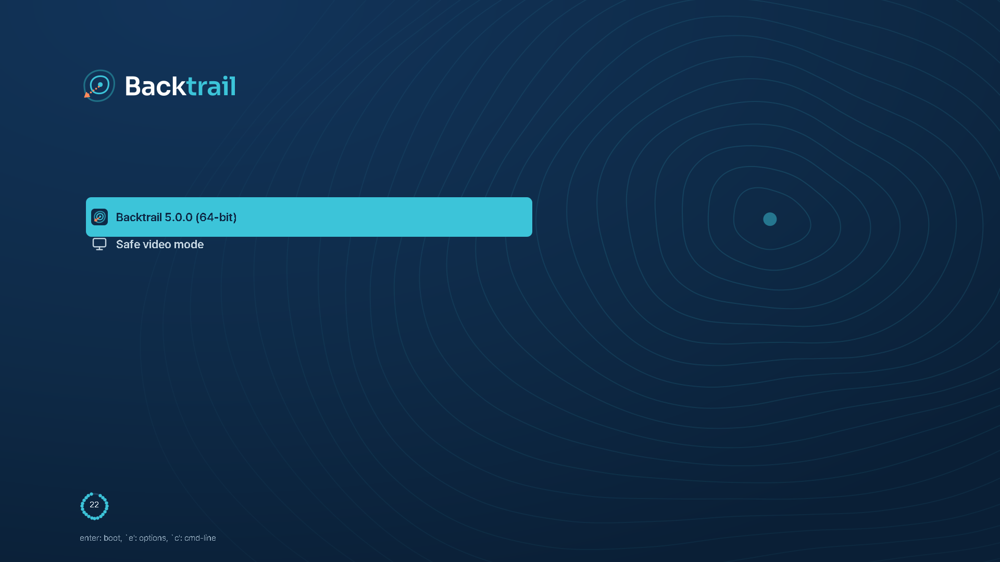
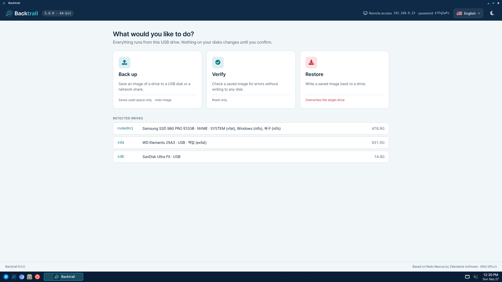
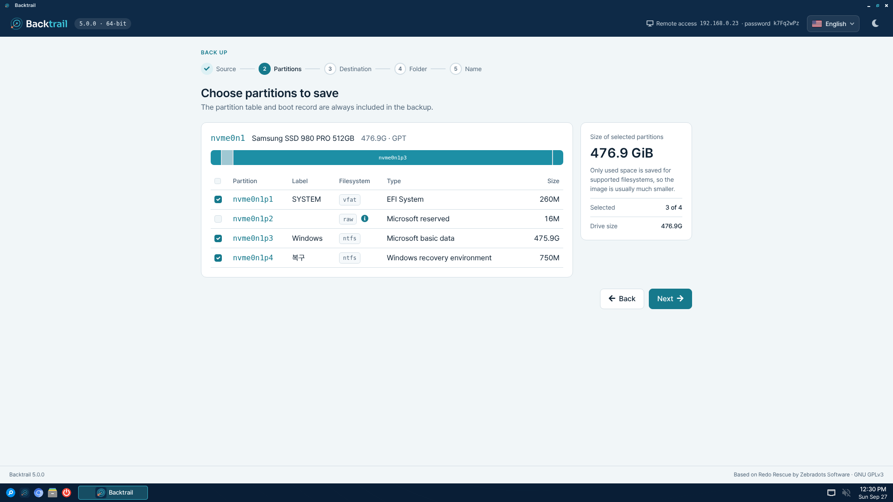
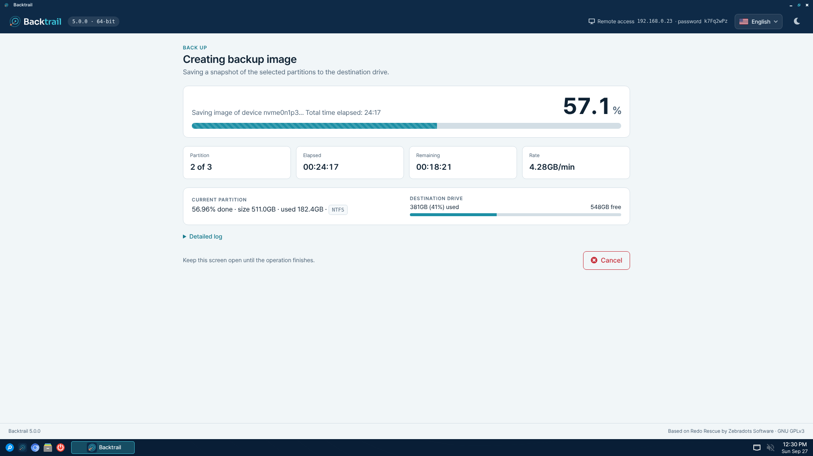
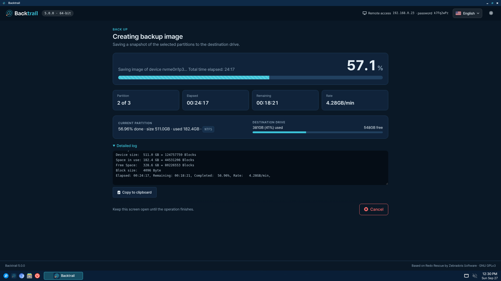
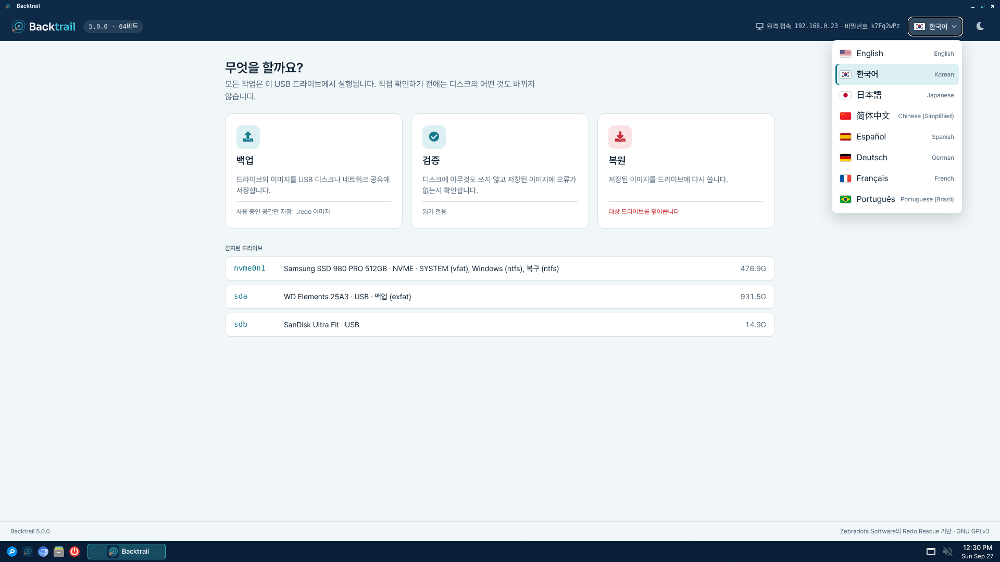

# Backtrail

  

## About

**Backtrail** is a live CD/USB system that creates and restores snapshots of
your system. Restore the image, even to a new blank drive, and recover in
minutes from ransomware and viruses, deletions, hardware damage, and hackers.

Backtrail is an independent open source project. Version 1.0 is its first
release.

## Heritage

Backtrail continues [Redo Rescue](https://github.com/redorescue/redorescue)
(earlier known as Redo Backup), created by Zebradots Software in 2010. Redo
Rescue's last release was 4.0.0 in 2021, and its development stopped in
October 2023 while 5.0.0 was still unreleased. Backtrail starts from that
point, with Redo Rescue's full commit history, and carries the work forward:

  * **Compatible images**: Backtrail keeps the `.redo` image format, so
    backups made with Redo Rescue, and with Redo Backup 1.0.4, restore with
    Backtrail.
  * **Same approach**: a live system with a simple step-by-step app on top of
    `sfdisk` and `partclone`, for bare-metal backup and recovery.
  * **Maintained**: a current Debian base with security updates, 32-bit PC
    support, translations and fixes for the problems found since.

Backtrail has its own name and artwork because Redo Rescue's logos and
graphics are not licensed for derived projects. It is not affiliated with or
endorsed by Zebradots Software. See [HERITAGE.md](HERITAGE.md) for what
Backtrail changed from Redo Rescue and why, and [CHANGES.md](CHANGES.md) for
the release history of both.

## Screenshots

  
  

  
  

  
  

Boot menu, welcome screen, partition selection, backup progress, detailed log (dark mode) and the language menu. The drives shown are sample data.

## Features

  * Free and open source software
  * Create a backup image in a few clicks
  * Live system; works on machines that won't even boot
  * Provides VNC access for remote assistance
  * Bare-metal recovery restores master boot record, partition table
  * Selectively restore certain parts
  * Optionally re-map original partitions to different places
  * UEFI Secure Boot support
  * Boots on 64-bit (Debian 13) and 32-bit (Debian 12) PCs from a single ISO
  * ISO can be written to CD or USB
  * Error handling and low space warnings
  * Detailed logs can be copied to clipboard
  * Restores images made with Redo Rescue and Redo Backup 1.0.4
  * Web application with PHP backend, shown in its own window (WebKitGTK)
  * Displays Chinese, Japanese and Korean partition labels and file names
  * Interface with light and dark modes
  * Interface in English, Korean, Japanese, Simplified Chinese, Spanish,
    German, French and Brazilian Portuguese
  * System tools and diagnostic programs included in image
  * Unified backup file format with ability to add notes
  * Shared network drive search and detection
  * Support for various block devices
  * Read/write support for Samba/CIFS shares, NFS shares, and SSH filesystems

## Download

Backtrail 1.0 is in preparation and has no published ISO yet; build one as
described under [Build](#build). Releases will be published on the
[Releases](https://github.com/johnhsb/backtrail/releases) page.

## Examples

Backtrail can be used in countless ways to recover from disaster, replicate a system, or just set things back to how they were before. Here are some example use cases:

* You've installed and activated Windows, configured all the necessary drivers, and installed an office suite for a family member. Because of the time involved, you don't want to have to repeat this process again. Use Backtrail to save a backup image to a USB stick in case the hard drive crashes.

* A teacher has dozens of identical machines in her classroom that run the same Linux-based operating system. She can use Backtrail to make a snapshot image of the working system, so that if a student's system becomes unusable she can easily restore the system to working condition in minutes.

* A company laptop has many different software components that require tedious configuration, and its users are more likely to click on links to malware or viruses. Use Backtrail to resize the existing partitions, create a backup partition on the same drive, and save a backup image.

* An office server needs to be upgraded with all new hardware, but the old system needs to stay running while the replacement is prepared. Use Backtrail to create an image, restore it to new hardware, and then make the switch with minimal downtime, while preserving the old machine in case of failure.

## Warning

**Backtrail is designed to restore a backup image to the same system it was taken from.** Even a byte-for-byte clone of a Windows drive to a target system that is nearly identical may fail to boot, regardless of the backup software used. Certain system changes can easily render a Windows, Mac, or Linux machine unbootable: changing hardware components, adding/removing/swapping disks, making significant configuration changes, or restoring to a different machine are all likely to cause boot issues. Similarly, swapping, moving, resizing, or reordering partitions will almost certainly render most operating systems unbootable. After such changes, an entire backup can be restored successfully (and all files are safely stored on the drive), yet the operating system may fail to boot. _This is not a limitation of the backup solution, but the result of changes to the system configuration. We strongly recommend creating a new backup image after changes are made to your system._

Backtrail relies on [sfdisk](https://manpages.debian.org/stretch/util-linux/sfdisk.8.en.html) to backup and restore partition tables, and [partclone](https://manpages.debian.org/stretch/partclone/partclone.8.en.html) to create and restore backups of the data on each partition. Both are considered very reliable but could contain unknown bugs.

## Notes

* By default the system logs in as the `root` user with password `redo`.

## Build

To build an ISO image from within Debian Linux:

  1. `git clone https://github.com/johnhsb/backtrail.git`
  2. `cd backtrail`
  3. `sudo ./make`

The result is `backtrail-VERSION.iso`, for example `backtrail-1.0.0.iso`.

The ISO contains a 64-bit (Debian 13) and a 32-bit (Debian 12) live system; the boot menu picks one based on the CPU. Build targets are set by `TARGETS` in the `make` script.

After building, it's easy to modify a file or install a package without rebuilding and downloading all the packages again:

  1. `sudo ./make changes` (or `sudo ./make changes amd64` / `i386` for one system)
  1. Make your changes to the live system image
  1. `exit` and the ISO will be updated automatically

Downloaded packages are kept in `cache/` (one folder per system), so later
builds only download packages that changed. To remove all build files
(the base system archives and `cache/` are kept), run `sudo ./make clean`;
delete `cache/` to free its space.

The logo, boot menu, splash screen and wallpaper images are generated from
`branding/src`; see [branding/README.md](branding/README.md).

Source code for Redo Rescue releases before its move to GitHub can be found
on [SourceForge](https://sourceforge.net/projects/redobackup/files/src/).

## License

**Backtrail** is released under the GNU GPLv3, like Redo Rescue, on which it
is based.

  * Copyright (C) 2026 The Backtrail Authors
  * Copyright (C) 2010-2023 Zebradots Software (Redo Rescue)

Redo Rescue's distinctive logos and graphics are not released under the GNU
GPLv3 and require derived projects to use their own. Backtrail replaces all of them with
its own artwork in `branding/`. The Pretendard and Sora typefaces are licensed
under the SIL Open Font License 1.1; the boot menu uses subsets of Pretendard
renamed "Backtrail Sans", as its license requires.

### Source code

The ISO is built from this repository and from Debian packages. Each live
system lists its packages in `/live-amd64/filesystem.packages` and
`/live-i386/filesystem.packages` on the ISO, and each release attaches the
same lists. The source of every listed package version is available from
[Debian](https://snapshot.debian.org/); if you cannot get it there, ask in an
[issue](https://github.com/johnhsb/backtrail/issues) and it will be provided.
